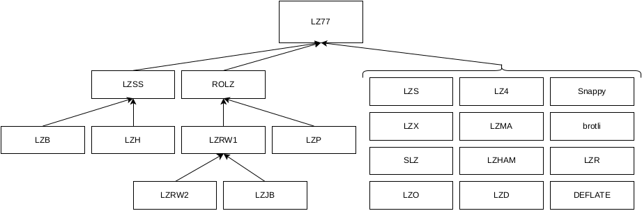

# Compression

This repository showcases an implementation and analysis of run-length encoding and dictionary encoding (LZ77) as part
of the application process for [Google Summer of Code 2024](https://summerofcode.withgoogle.com/programs/2024).

## Implementation Details

As this is a proof of concept, I decided to implement byte-based (`uint8_t`) compression only. The drawback hereby
is that the algorithms perform poorly on certain data types. For example, consider values of an image: `377 377 377`.
My run-length encoder will not be successful, as the result would be `1x3 2x7 1x3 2x7 1x3 2x7`, however, a better
output would be `3x377`. For real-world use cases, an implementation based on C++ templates that supports arbitrary
data types is desirable.

### Run-length Codec

A run in a sequence of symbols are consecutive recurring symbols. Run-length Encoding (RLE) counts each run and
replaces it with the code `(s, l)`, where `s` is the symbol and `l` is the number of repeats.

My RLE implementation can be improved by omitting `l`, the number of repeats for symbols that occur only once. For
example, `AAABCCC` is currently compressed to `3A1B3C`, but the improvement would reduce the length of this sequence
by one (`3AB3C`).

### Dictionary Codec

Dictionary encoding exploits repeated patterns. The recurring patterns are written into a dictionary, and the
occurrences of these patterns in data are replaced with the corresponding index of the dictionary entry.

I decided to implement LZ77 [[1]](https://ieeexplore.ieee.org/abstract/document/1055714), as it is one of the
fundamental dictionary codecs. LZ77 uses backreferencing and a sliding window to create a dictionary in order to
compress data. The window consists of a *search buffer* that compromises the recently encoded sequence and a *look-ahead
buffer* which encompasses the next sequence to encode. The first symbol in the look-ahead buffer is matched against
a sequence in the search buffer by traversing the search buffer from back to front. This offset `o` is then stored as
part of a triple along with the length of the matched string `l` and the first mismatching symbol `c` of the look-ahead
buffer: `(o, l, c)`.

My implementation of LZ77 requires using the same instance for decoding as was used for encoding. The reason is that I
need to store the position that marks the separation of the uncompressed and compressed part (`compressedPosition`),
such that the decoder knows where to start. A solution to this limitation would be to encode this position at the
beginning of the compressed data, resulting in a bit more overhead.

### Summary

In general, the above presented algorithms only form the basis and offer a lot of room for improvements. It is
common to combine different approaches, for which, both RLE and LZ77 form the basis. For example, RLE's performance
can be drastically improved with pre-processing, such as with the Burrows–Wheeler transformation. As depicted below,
LZ77 sparked a number of new algorithms.

## Results

The analysis results can be found at [benchmark/Results.md](./benchmark/Results.md).
